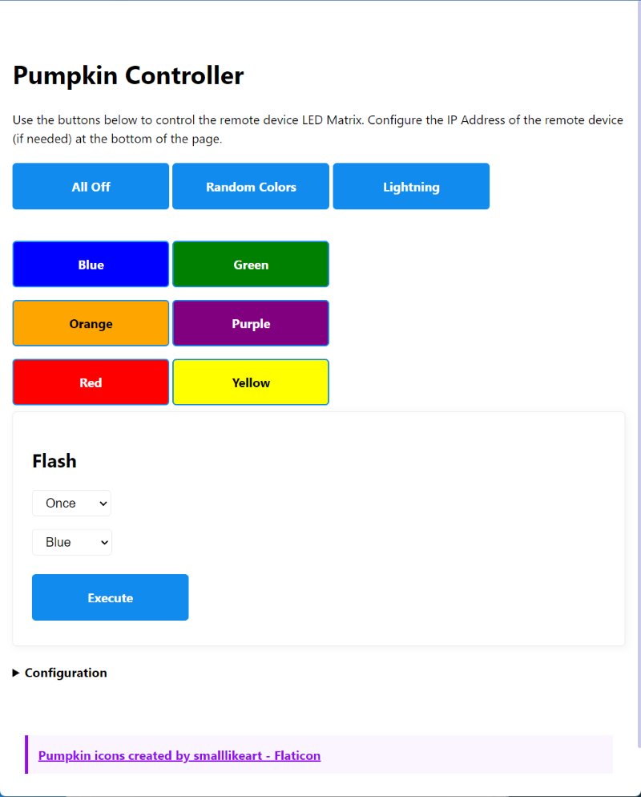

# Pumpkin LED Controller

This is a web application used to control the [Glowing Pumpkin Server (HTTP)](https://github.com/johnwargo/glowing-pumpkin-server-http) hosted on [Netlify](https://pumpkin-controller.netlify.app/).

The original project ([Glowing Pumpkin Xiao 5x5 BFF](https://github.com/johnwargo/glowing-pumpkin-xiao-bff)) was a ESP32 device with a 5x5 NeoPixel matrix attached to it that you place in a carved pumpkin. The device randomly switches between a set of Halloweeny colors and periodically flashes white lights to simulate lightning or electrical sparks. 

I added a web server in the Glowing Pumpkin Server (HTTP) project and, because of that needed a remote application to turn the LEDs on and off, enable random colors, trigger lightning, etc. This is that web application project.

There's really nothing special about the app, it's a single page app (SPA) styled using [MVP.css](https://andybrewer.github.io/mvp/). It displays a bunch of buttons the user (you, I imagine) clicks or taps to control the LED matrix on the remote device.

Here's what the app looks like in Chrome:

You can clone this repository and execute the app locally, but I also publish it through [Netlify](https://www.netlify.com/) which offers free hosting for open source projects (which this project is). Here's a link to the [hosted app](https://pumpkin-controller.netlify.app/).

## Usage

To use the app with the remote web server, you must first configure the app with the IP Address of the remote device. If you look at the bottom of the page, you'll see a Configuration option, click on the triangle to open the configuration form as shown in the following figure:

Enter the IP Address for the remote web server, click the **Submit** button, and you're all set. 

There is, however, a better way.

The easiest way to access the web server, load the web app, and automatically configure it is to open a browser window and enter the network name for the web server device. The web server code is configured to automatically setup the device on the network with an easy to remember name (instead of an IP Address). The default name is `pumpkin`, so you can load the web server's root page using the address `pumpkin.local`.

**Note:** If you changed the `HOSTNAME` definition in the web server sketch, you'll have to use the host name you entered there plus `.local` to access it from the browser without using the IP Address.

When you load the web server's root page, it displays a simple redirecting web page then loads the Pumpkin LED Controller app plus passes in the IP address for the web server. With this approach, the web server automatically configures the app as it opens it for you. How cool is that?

***

You can find information on many different topics on my [personal blog](http://www.johnwargo.com). Learn about all of my publications at [John Wargo Books](http://www.johnwargobooks.com).

If you find this code useful and feel like thanking me for providing it, please consider <a href="https://www.buymeacoffee.com/johnwargo" target="_blank">Buying Me a Coffee</a>, or making a purchase from [my Amazon Wish List](https://amzn.com/w/1WI6AAUKPT5P9).